# 自動車向けマルチモーダルAI開発

[English](./README.md)

**Snowflake 上だけで完結する、エンドツーエンドな自動車向けマルチモーダル AI 開発**

Hugging Face から [comma2k19](https://huggingface.co/datasets/commaai/comma2k19) データセット (comma.ai、MIT ライセンス、公開データセット) を Snowflake に取り込み、データ抽出・整理・可視化・特徴抽出・マルチモーダル学習・分散学習・実験管理・モデル登録・比較ダッシュボード・オンライン推論サービングという 9 つのフェーズをエンドツーエンドで実行します。

> 前方カメラの映像とセンサーから先行車までの距離を推定するAIモデルを、レーダーの距離計測値を正解ラベルとして学習させます。センサーデータと画像を組み合わせることでモデル精度が改善されることを検証します。
> マルチモーダルAIの開発を Snowflake 上で再現するリファレンス実装です。

---

## 目的

- このプロジェクトの目的は Snowflake 上でマルチモーダルなデータセットを使った AI モデル開発の実践方法をサンプルコードとともに解説することです。
- データセットとして Hugging Face から [comma2k19](https://huggingface.co/datasets/commaai/comma2k19) データセット (comma.ai、MIT ライセンス、公開データセット) を活用します。
- 本データセットは、米カリフォルニア州の高速道路 (Highway 280) 上を走行した約 33 時間分のドライブデータを収録した自動運転向けの公開データセットです。comma.ai の車載デバイス「comma EON」で収集され、以下が時刻同期された状態で記録されています。
  - フロントカメラ映像 (20Hz)
  - GPS
  - IMU (加速度・角速度)
  - 車両の OBD-II/CAN バス経由で取得したステアリング角度・速度・レーダーによる先行車との距離・相対速度
- データ全体は 1 分間ごとの「セグメント」単位に分割されており (`raw_data/Chunk_1.zip`〜`Chunk_10.zip` で合計約 2,019 セグメント、約94.6GB)、本プロジェクトのデフォルトでは `Chunk_1` (188 セグメント、8.73GB) のみを使用します。

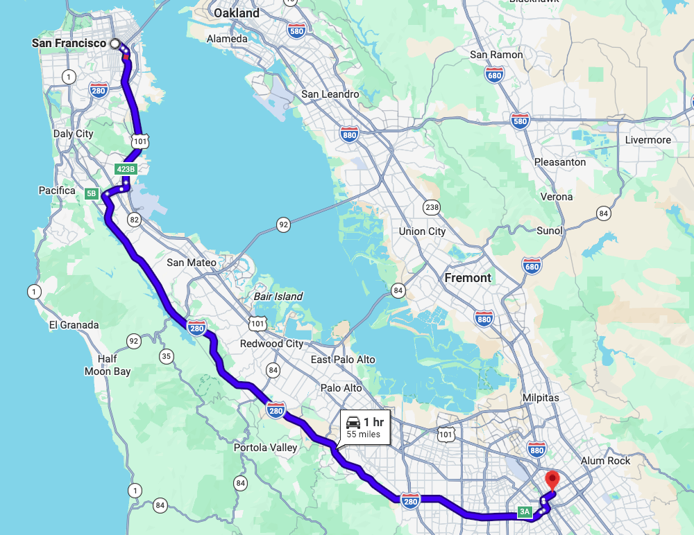

- データ例 (`CURATED.SENSORS` テーブルの一部の列。1 行 = 1 フレーム):

  | SEGMENT_ID | FRAME_IDX | T [s] | DISTANCE (レーダー先行車距離) [m] | STEERING_ANGLE [deg] | ACCEL_X/Y/Z [m/s²] | SPLIT |
  |---|---|---|---|---|---|---|
  | b0c9d2329ad1606b_2018-07-27--06-03-57_10 | 248 | 12.4 | 43.2 | -2.1 | 0.12 / -0.03 / 9.79 | train |
  | b0c9d2329ad1606b_2018-07-27--06-03-57_10 | 600 | 30.0 | 9.8 | 15.4 | -0.85 / 0.21 / 9.81 | train |
  | b0c9d2329ad1606b_2018-07-27--06-03-57_11 | 912 | 45.6 | 91.5 | 0.3 | 0.02 / 0.00 / 9.80 | test |


- 本プロジェクトを通して以下を学ぶことを目指します。
  - 動画・センサーログといった生のマルチモーダルデータを External Access Integration 経由で外部 (Hugging Face) から Snowflake に取り込む方法 (Phase 1)
  - ML Jobs / Ray を使い、大容量の動画 (HEVC) デコードやセンサーログの同期・ラベル生成を分散処理でスケールさせる実装パターン (マルチノード・マルチスレッドの使い分け、Phase 2)
  - Notebooks in Workspaces を使ったデータ品質チェック・EDA (可視化) のワークフロー (Phase 3, 4)
  - 学習済みバックボーンモデルを使った画像埋め込み (embedding) 抽出の分散実行 (Phase 5)
  - センサー単体・画像単体・センサー+画像の融合という 3 つのモデルを設計し、それぞれの精度を比較する「アブレーション」の考え方と実践 (Phase 6, 7)
  - `PyTorchDistributor` による本格的な分散学習 (`torch.distributed` DDP) の実装 (Phase 7)
  - ML Experiments によるトレーニングの実験管理と、Model Registry によるモデルのバージョン管理 (Phase 8)
  - Streamlit による実験結果の可視化・比較ダッシュボードの構築 (Phase 8)
  - Snowpark Container Services (SPCS) を使った、学習済みモデルのオンライン推論サービングと、その UI からのリアルタイム呼び出し (Phase 9)

---

## アーキテクチャ

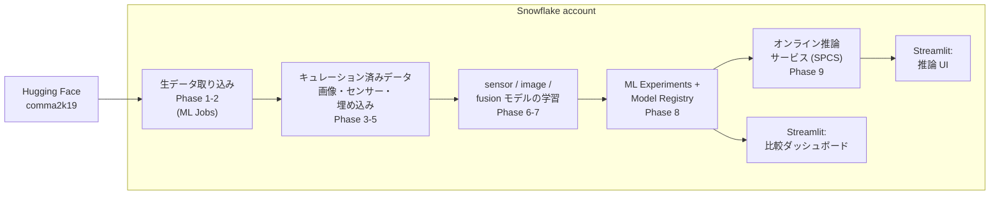
```mermaid
flowchart LR
    HF["Hugging Face<br/>comma2k19"]

    subgraph SF["Snowflake account"]
        direction LR
        RAW["生データ取り込み<br/>Phase 1-2<br/>(ML Jobs)"]
        CUR["キュレーション済みデータ<br/>画像・センサー・<br/>埋め込み<br/>Phase 3-5"]
        TRAIN["sensor / image /<br/>fusion モデルの学習<br/>Phase 6-7"]
        REG["ML Experiments +<br/>Model Registry<br/>Phase 8"]
        SERVE["オンライン推論<br/>サービス (SPCS)<br/>Phase 9"]
        DASH["Streamlit:<br/>比較ダッシュボード"]
        UI["Streamlit:<br/>推論 UI"]

        RAW --> CUR --> TRAIN --> REG
        REG --> DASH
        REG --> SERVE --> UI
    end

    HF --> RAW
```

9 つのフェーズを Snowflake 上の 4 つの構成要素に集約しています:
1. 生データセットの **取り込みとキュレーション** (Phase 1-5)
2. 3 つのアブレーションモデルの **学習** (Phase 6-7)
3. それらの **追跡・登録** (Phase 8)
4. **比較ダッシュボード** で確認、および **オンライン推論** としてサービング (Phase 9) 

という流れです。

各フェーズの詳細設計、テーブル/ステージ名、コンピュートプールの割り当て等については、以下のフェーズ別の説明を参照してください。

## 前提条件

- Snowflake アカウント (Container Runtime Notebooks / ML Jobs / SPCS が利用可能であること)
  - **必要な最低エディション: Enterprise Edition 以上。** 
  - Snowpark Container Services (コンピュートプール / `CREATE SERVICE`。Phase 1/2/5/7 の各 ML Job、Phase 3/4/6 の Notebooks in Workspaces、Phase 9 のモデルサービングすべてで使用) は Standard Edition では利用できず、`CREATE COMPUTE POOL` が失敗します。Snowflake の通常の30日間トライアルアカウントはデフォルトで Enterprise Edition として作成されるため、そのままでこの要件を満たしますが、明示的に Standard Edition を選択したアカウントでは動作しません。
  - エディション要件は変更される可能性があるため、実行前に [SPCS のエディション要件](https://docs.snowflake.com/ja/developer-guide/snowpark-container-services/overview)を最新のドキュメントで確認してください。
- `ACCOUNTADMIN` 相当の権限 (初回のインフラ構築時のみ)
- ローカル環境:　Python 3.11+、[`uv`](https://docs.astral.sh/uv/)
- Snowflake 接続情報:　`cortex connections` で設定した接続、または `~/.snowflake/connections.toml`

( **このプロジェクトは特定のアカウント名に依存しない設計です。** )

## セットアップ

```bash
uv venv --python 3.11 ~/.venvs/car_multimodal_ai_sample
uv pip install --python ~/.venvs/car_multimodal_ai_sample -e ".[dev]"
source ~/.venvs/car_multimodal_ai_sample/bin/activate
```

> **仮想環境はプロジェクトのルート「外」に作成してください** (`./.venv` ではありません)。
> ML Job の送信パスはプロジェクトの一部だけ (`jobs/` + `src/` + `conf/` のみ、 `scripts/_submit_common.py` を参照) をフィルタしてコピーするため、リポジトリ内に venv を置いても致命的ではなくなりましたが、数 GB に及ぶ依存関係ツリーをプロジェクトディレクトリ外に置いておくことで、ディレクトリを走査するツールとの予期しない衝突を避けられます。

環境変数として以下を前提とします:

```bash
# cortex connections や ~/.snowflake/connections.toml と連携
export SNOWFLAKE_CONNECTION_NAME=<your-connection>
```

以降のコマンドはすべて **プロジェクトのルートから** 実行するものとします。

### 1. Setup — インフラを構築する(初回のみ、ACCOUNTADMIN)

**実行方法:**

```bash
python3 scripts/setup.py
```

**実行内容**

- `infra/01_setup_database.sql` はデータベース、ウェアハウス、コンピュートプール、ロール、そして以降のフェーズが書き込む全ステージを作成します。`infra/02_external_access.sql` は ML Jobs/Notebooks が Hugging Face(データセットのダウンロード)、PyPI (ML Jobs の `pip_requirements`)、PyTorch Hub (Phase 5 の学習済みバックボーンの重み) にアクセスできるようにするネットワークルール + External Access Integration を作成します。すべての文は `CREATE ... IF NOT EXISTS` であるため、このスクリプトは冪等です。一部失敗後の再実行や、プロジェクト更新の取り込みのための再実行も安全です。
- 同等の操作: Snowsight のワークシートや任意の SQL クライアントで `infra/01_setup_database.sql` の後に `infra/02_external_access.sql` を実行しても構いません。 `scripts/setup.py` は Snowpark経由でこの 2 つのファイルを 1 文ずつプログラム的に実行し、各結果を出力するものです。

**結果:** 以下のオブジェクトがアカウント内に作成され、すべて `MULTIMODAL_APP_ROLE` が所有者になります。

| オブジェクト | 名前 |
|---|---|
| データベース | `CAR_MULTIMODAL_AI_DB` (スキーマ: `RAW`/`CURATED`/`ML`/`APP`) |
| ウェアハウス | `MULTIMODAL_WH` |
| コンピュートプール | `MULTIMODAL_CPU_POOL` (必須) / `MULTIMODAL_GPU_POOL` (任意) |
| ロール | `MULTIMODAL_APP_ROLE` |
| ステージ | `RAW.RAW_STAGE`、`CURATED.IMAGES_STAGE`、`CURATED.FEATURES_STAGE`、`CURATED.MISC_STAGE`、`CURATED.JOB_STAGE` |
| ワークスペース | `ML.CAR_MULTIMODAL_AI` (Phase 3/4/6 の Notebooks in Workspaces) |
| External Access | `HF_ACCESS_INTEGRATION`、`PYPI_ACCESS_INTEGRATION`、`PYTORCH_HUB_ACCESS_INTEGRATION` |

なお、この README の他の部分はアカウント固有の値に依存していません。Container Runtime Notebooks / ML Jobs / SPCS が有効な任意の Snowflake アカウントで同じコマンドを実行可能です。

### 2. 各フェーズを実行する

各フェーズを順番に実行してください。すべての `jobs/*.py` スクリプトと `scripts/submit_phase*.py` のラッパーは `--dry-run` (少数のセグメント/サンプルのみ処理) をサポートしています。本番実行の前に必要に応じてドライランで確認してください。

**ML Jobs の実行について**(Phase 1、2、5、7): `scripts/submit_phase*.py` は `snowflake-ml-python` の Python API (`submit_directory`)を直接呼び出します。コマンド実行はデフォルトで非同期です (完了までブロックしてログを出力する場合は `--wait` を追加)。実行後にステータスを確認する場合は `job.get_logs()` や Snowsight の Jobs ページをご確認ください。

**Notebooks in Workspacesの利用について**(Phase 3、4、6): `scripts/upload_notebooks.py` は各 `.ipynb` ファイル (と、それがインポートする `src/`/`conf/`) を `ML.CAR_MULTIMODAL_AI` ワークスペースのライブバージョンに PUT してコミットします。Notebook の実行は、Snowsight (Projects > Workspaces > CAR_MULTIMODAL_AI > notebooks/) から直接 `.ipynb` ファイルを開いて実行してください。

#### Phase 1 — 生データの取り込み

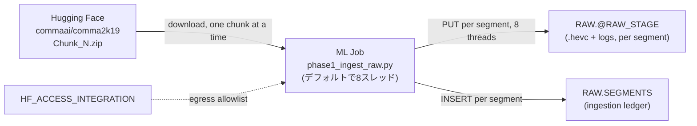
```mermaid
flowchart LR
    HF["Hugging Face<br/>commaai/comma2k19<br/>Chunk_N.zip"]
    EAI["HF_ACCESS_INTEGRATION"]
    JOB["ML Job<br/>phase1_ingest_raw.py<br/>(デフォルトで8スレッド)"]
    STAGE["RAW.@RAW_STAGE<br/>(.hevc + logs, per segment)"]
    LEDGER["RAW.SEGMENTS<br/>(ingestion ledger)"]

    HF -->|download, one chunk at a time| JOB
    EAI -.->|egress allowlist| JOB
    JOB -->|PUT per segment, 8 threads| STAGE
    JOB -->|INSERT per segment| LEDGER
```

```bash
python3 scripts/submit_phase1.py --dry-run --limit 3   # 動作確認:3セグメントのみ
python3 scripts/submit_phase1.py                        # デフォルト:8スレッドで全188セグメント(約3-4分*)
python3 scripts/submit_phase1.py --concurrency 1         # 逐次ステージング(スレッド化なし)
```

- **内容:** `jobs/phase1_ingest_raw.py` は Hugging Face から `Chunk_1.zip` (または `conf/prepare.yaml: huggingface.chunks` で選択したチャンク) をダウンロードし、セグメントごとに展開して、各セグメントの `.hevc` + `processed_log/` + `global_pose/` ファイルを `@RAW_STAGE` に push します。
  - チャンクは 1 つずつ処理されます (ダウンロード → 展開 → ステージング → ローカルコピー削除 → 次のチャンク)。そのため `chunks: "all"` でもローカルディスクの使用量のピークは 1 チャンク分に留まります。
  - **チャンク内のセグメントのステージングはデフォルトでマルチスレッド化**: 各セグメントのPUT呼び出しはネットワークアップロード待ちが主体のI/Oバウンドな処理なので、スレッドプールを使うことで追加のコンピュートプールノードなしに、単一コンテナ内で実際の実行時間短縮が得られます。(`--concurrency N`、デフォルト8) 
  - 各ワーカースレッドは自分自身のSnowparkセッションを開きます。共有のドライバーセッションは複数スレッドからの同時利用に対して安全ではないためです。
  - `--concurrency 1` を指定すると完全に逐次的なステージングになります。
- **結果:** `RAW.RAW_STAGE` にセグメントごとのフォルダが作成されます。`RAW.SEGMENTS` (台帳テーブル) には各セグメントの取り込み状態が記録され、以降のフェーズが破損セグメントをスキップする際に使われます。
- 注意: この書き込みは **追記** であるため、すでに `SEGMENTS` にデータが存在するアカウントでこのフェーズを再実行すると、行が重複します。クリーンに再実行したい場合は先にテーブルをtruncateしてください。

#### Phase 2 — 抽出と整理

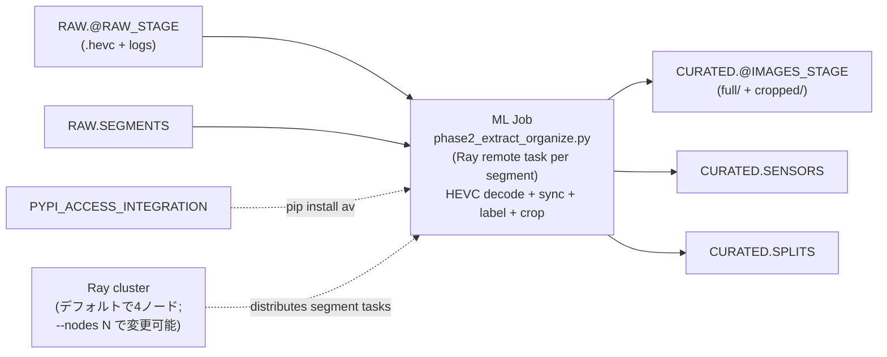
```mermaid
flowchart LR
    STAGE["RAW.@RAW_STAGE<br/>(.hevc + logs)"]
    LEDGER["RAW.SEGMENTS"]
    PYPI["PYPI_ACCESS_INTEGRATION"]
    RAYC["Ray cluster<br/>(デフォルトで4ノード;<br/>--nodes N で変更可能)"]
    JOB["ML Job<br/>phase2_extract_organize.py<br/>(Ray remote task per segment)<br/>HEVC decode + sync + label + crop"]
    IMG["CURATED.@IMAGES_STAGE<br/>(full/ + cropped/)"]
    SENS["CURATED.SENSORS"]
    SPL["CURATED.SPLITS"]

    STAGE --> JOB
    LEDGER --> JOB
    PYPI -.->|pip install av| JOB
    RAYC -.->|distributes segment tasks| JOB
    JOB --> IMG
    JOB --> SENS
    JOB --> SPL
```

```bash
python3 scripts/submit_phase2.py --dry-run --limit 3
python3 scripts/submit_phase2.py                          # デフォルト:4ノードのRayクラスタで自動分散
python3 scripts/submit_phase2.py --nodes 1                 # 単一ノード実行(マルチノード分散なし)
```

- **内容:** `jobs/phase2_extract_organize.py` は各セグメントのデータを抽出します。具体的には HEVC 動画をデコードし、CAN/IMU センサーログをカメラのタイムスタンプに同期させ、レーダーに基づく先行車距離ラベルを生成し、フレームを画面下中央の領域 (rows 0.40–0.82, cols 0.22–0.78) にクロップして、その結果の画像を `@IMAGES_STAGE` (`full/` と `cropped/`) にステージングします。
  - 各セグメントはRay の remote task として投入されます。**デフォルトで4個の `MULTIMODAL_CPU_POOL` ノードを要求します** (`--nodes N`、`submit_directory(..., target_instances=N)` にマッピング)。Ray のスケジューラーがセグメントごとのタスクを全ノードに分散します。
  - 各タスクはドライバーのセッションを共有せず、自分自身のSnowpark セッションを開きます。これはセッションがワーカープロセス間で pickle できないためです。
  - `--nodes 1` を指定すると単一ノード実行になります。
- **結果:** `CURATED.IMAGES_STAGE` にすべてのフレームが格納され、`CURATED.SENSORS` (フレームごとのセンサー値 + 距離ラベル) と `CURATED.SPLITS` (セグメント単位のtrain/val/test 割り当て) が `write_pandas(auto_create_table=True)` によって作成されます。
- 注意: この書き込みは `overwrite=False` (追記) であるため、すでに `SENSORS`/`SPLITS` にデータが存在するアカウントでこのフェーズを再実行すると、行が重複します。クリーンに再実行したい場合は先に両テーブルを削除してください。

**スクリーンショット** 抽出したデータの確認

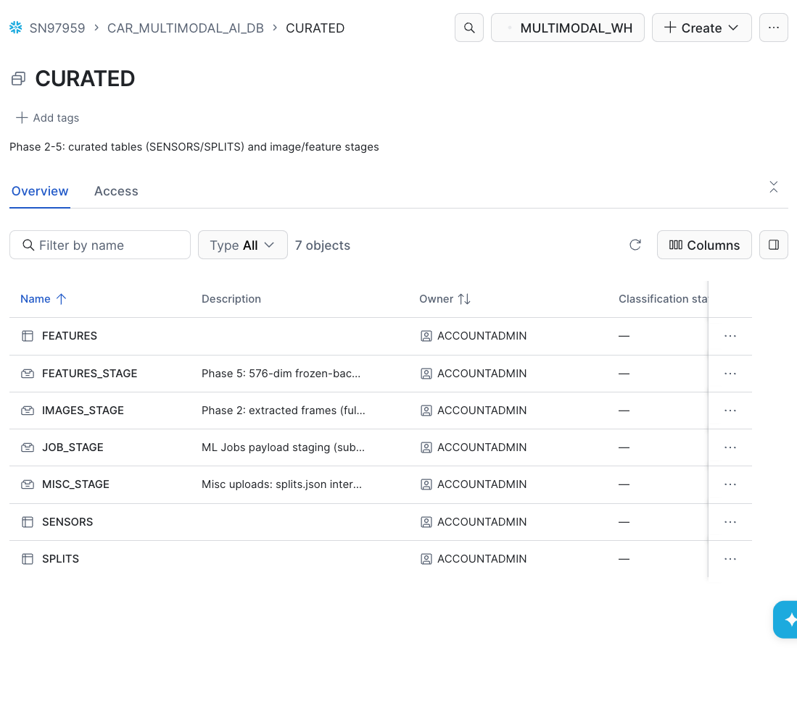

#### Phase 3 — テーブル登録の最終確認

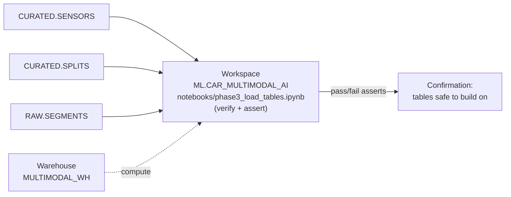
```mermaid
flowchart LR
    SENS["CURATED.SENSORS"]
    SPL["CURATED.SPLITS"]
    LEDGER["RAW.SEGMENTS"]
    WS["Workspace<br/>ML.CAR_MULTIMODAL_AI<br/>notebooks/phase3_load_tables.ipynb<br/>(verify + assert)"]
    WH["Warehouse<br/>MULTIMODAL_WH"]

    SENS --> WS
    SPL --> WS
    LEDGER --> WS
    WH -.->|compute| WS
    WS -->|pass/fail asserts| OK["Confirmation:<br/>tables safe to build on"]
```

```bash
python3 scripts/upload_notebooks.py --phase 3
```

続いて Snowsight で **Projects > Workspaces > CAR_MULTIMODAL_AI >　notebooks/phase3_load_tables.ipynb** を開き、全セルを実行してください。

- **内容:** このノートブックは `CURATED.SENSORS`/`CURATED.SPLITS` をクエリし、acceptance criteria と照合します。
  - train/val/test の分割比率が概ね 70/15/15 であること。
  - 距離ラベルの分布が median 47.8 m、p10 = 9.0 m、range 3.0–149.8 m と一致すること（事前に実測済み）。
  - 有効ラベル率が 77.8% の ±5pt 以内であること。
- **結果:** ノートブックの assert によって、Phase 2 の出力テーブルが正しく、進めても安全であることが確認されます。

#### Phase 4 — データ可視化 / EDA

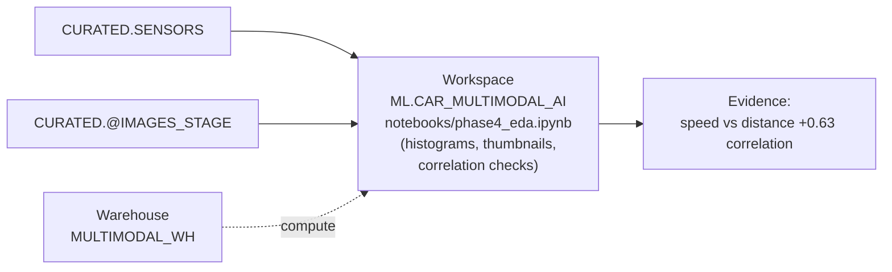
```mermaid
flowchart LR
    SENS["CURATED.SENSORS"]
    IMG["CURATED.@IMAGES_STAGE"]
    WS["Workspace<br/>ML.CAR_MULTIMODAL_AI<br/>notebooks/phase4_eda.ipynb<br/>(histograms, thumbnails,<br/>correlation checks)"]
    WH["Warehouse<br/>MULTIMODAL_WH"]

    SENS --> WS
    IMG --> WS
    WH -.->|compute| WS
    WS --> EV["Evidence:<br/>speed vs distance +0.63 correlation"]
```

```bash
python3 scripts/upload_notebooks.py --phase 4
```

続いて Snowsight で **Projects > Workspaces > CAR_MULTIMODAL_AI > notebooks/phase4_eda.ipynb** を開き、全セルを実行してください。

- **内容:** このノートブックは距離ラベルのヒストグラムを描き、サンプルフレームのサムネイルギャラリーをレーダー距離と併記して表示し、センサーチャンネルと距離の相関 (`speed` と距離の+0.63 の相関の再現) を確認し、セグメントごとの有効ラベル率をプロットして低品質な外れ値を検出します。
- **結果:** データが妥当であることの視覚的な確認と、Phase 6/7 でセンサー系の学習入力から `speed` を除外する理由となる具体的な根拠 (`speed` の +0.63 の相関) が得られます。

**スクリーンショット** EDAの例

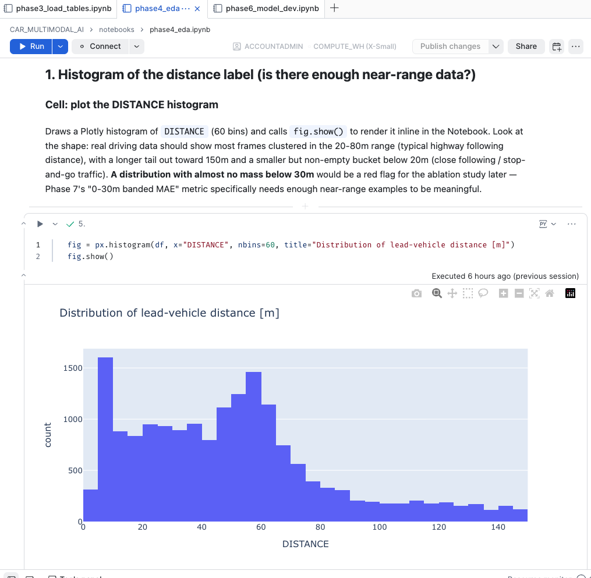

#### Phase 5 — 画像埋め込みの抽出

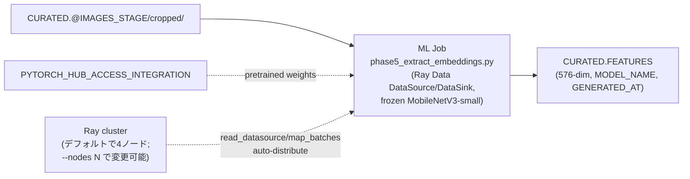
```mermaid
flowchart LR
    IMG["CURATED.@IMAGES_STAGE/cropped/"]
    PTH["PYTORCH_HUB_ACCESS_INTEGRATION"]
    RAYC["Ray cluster<br/>(デフォルトで4ノード;<br/>--nodes N で変更可能)"]
    JOB["ML Job<br/>phase5_extract_embeddings.py<br/>(Ray Data DataSource/DataSink,<br/>frozen MobileNetV3-small)"]
    FEAT["CURATED.FEATURES<br/>(576-dim, MODEL_NAME, GENERATED_AT)"]

    IMG --> JOB
    PTH -.->|pretrained weights| JOB
    RAYC -.->|read_datasource/map_batches<br/>auto-distribute| JOB
    JOB --> FEAT
```

```bash
python3 scripts/submit_phase5.py --dry-run --limit 20
python3 scripts/submit_phase5.py                          # デフォルト:4ノードのRayクラスタで自動分散
python3 scripts/submit_phase5.py --nodes 1                 # 単一ノード実行(マルチノード分散なし)
```

- **内容:** `jobs/phase5_extract_embeddings.py` は `@IMAGES_STAGE/cropped/` から各クロップ済みフレームを直接並列に読み込み、それぞれを ImageNet 事前学習済みの MobileNetV3-small バックボーン (分類ヘッドを除去) に通し、フレームごとに 576 次元の特徴ベクトルを生成します。
  - **デフォルトで4個の `MULTIMODAL_CPU_POOL` ノードを要求します** (`--nodes N`、`submit_directory(..., target_instances=N)` にマッピング)。`ray.data.read_datasource()` / `.map_batches()` はすでにクラスタの全ノードに処理を自動的に分散します。
  - `--nodes 1` を指定すると単一ノード実行になります。
- **結果:** `CURATED.FEATURES` (サンプルごとに 1 行の 576 次元の float 埋め込みで、`MODEL_NAME` /`GENERATED_AT` の provenance カラムを含む) が phase 6, 7 で学習に使うデータです。

**スクリーンショット** 抽出した特徴量

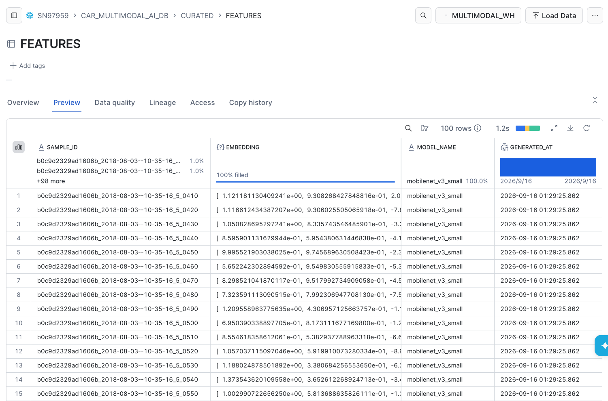

#### Phase 6 — モデル開発(小規模検証)

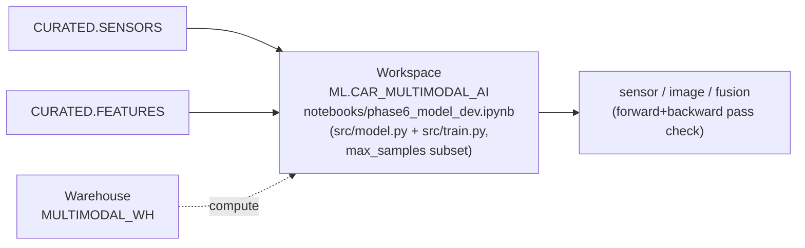
```mermaid
flowchart LR
    SENS["CURATED.SENSORS"]
    FEAT["CURATED.FEATURES"]
    WS["Workspace<br/>ML.CAR_MULTIMODAL_AI<br/>notebooks/phase6_model_dev.ipynb<br/>(src/model.py + src/train.py,<br/>max_samples subset)"]
    MODELS["sensor / image / fusion<br/>(forward+backward pass check)"]
    WH["Warehouse<br/>MULTIMODAL_WH"]

    SENS --> WS
    FEAT --> WS
    WH -.->|compute| WS
    WS --> MODELS
```

```bash
python3 scripts/upload_notebooks.py --phase 6
```

続いて Snowsight で **Projects > Workspaces > CAR_MULTIMODAL_AI >　notebooks/phase6_model_dev.ipynb** を開き、全セルを実行してください。

- **内容:** このノートブックは `src/model.py` の 3 つのアブレーションモデル (sensor-only、image-only、sensor-image fusion) をすべて定義し、それぞれを小規模なサブセット (`max_samples`、数百行程度) で学習 (`src.train.run()`) を実行します。forward/backward パスが問題なく完了し、数秒〜数十秒で loss が減少することを確認する程度です。
- **結果:** 3 つのモダリティすべてがこの Notebook の Container Runtime でエラーなく学習できることの確認と、そのサブセットでの参考メトリクスが得られます。

#### Phase 7 — 本番規模の分散学習

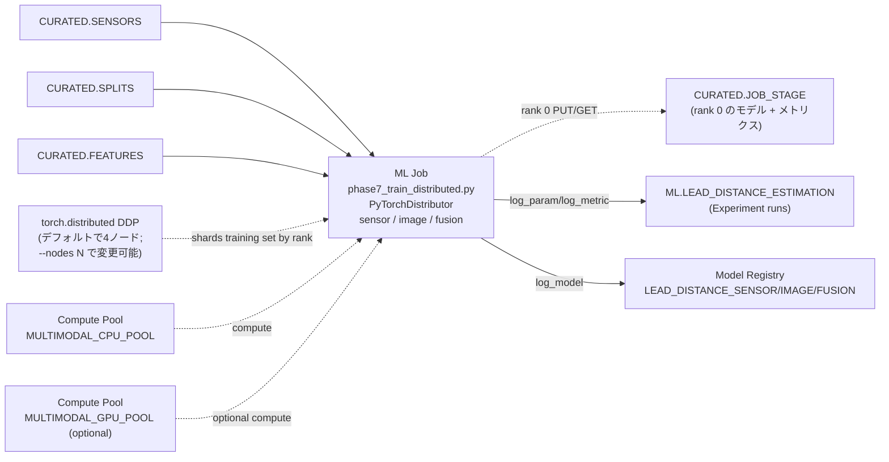
```mermaid
flowchart LR
    SENS["CURATED.SENSORS"]
    SPL["CURATED.SPLITS"]
    FEAT["CURATED.FEATURES"]
    RAYC["torch.distributed DDP<br/>(デフォルトで4ノード;<br/>--nodes N で変更可能)"]
    JOB["ML Job<br/>phase7_train_distributed.py<br/>PyTorchDistributor<br/>sensor / image / fusion"]
    ARTSTAGE["CURATED.JOB_STAGE<br/>(rank 0 のモデル + メトリクス)"]
    CPUPOOL["Compute Pool<br/>MULTIMODAL_CPU_POOL"]
    GPUPOOL["Compute Pool<br/>MULTIMODAL_GPU_POOL (optional)"]
    EXP["ML.LEAD_DISTANCE_ESTIMATION<br/>(Experiment runs)"]
    REG["Model Registry<br/>LEAD_DISTANCE_SENSOR/IMAGE/FUSION"]

    SENS --> JOB
    SPL --> JOB
    FEAT --> JOB
    RAYC -.->|shards training set by rank| JOB
    JOB -.->|rank 0 PUT/GET| ARTSTAGE
    CPUPOOL -.->|compute| JOB
    GPUPOOL -.->|optional compute| JOB
    JOB -->|log_param/log_metric| EXP
    JOB -->|log_model| REG
```

```bash
python3 scripts/submit_phase7.py --dry-run --max-samples 500
python3 scripts/submit_phase7.py                          # デフォルト:4ノードでの本物のDDP、3モダリティ全て
python3 scripts/submit_phase7.py --modality fusion         # またはモダリティを1つだけ実行
python3 scripts/submit_phase7.py --nodes 1                 # 単一ノードでのスモークテスト(DDPなし)
```

- **内容:** `jobs/phase7_train_distributed.py` は 3 つのアブレーション条件すべてを全量データで学習します。
  - **デフォルトで4ノードによる本物の `torch.distributed` DDP 学習を実行します** (`conf/train.yaml: distributed.num_nodes: 4`、`--nodes N` で上書き可能、`submit_directory(..., target_instances=N)` にマッピングされます)
  - 各ワーカーが自分自身の Snowpark セッションを構築し、学習データの disjoint なシャードを学習し、DDP がステップごとに勾配を all-reduce することで全ランクのモデルが同期された状態を保ちます。ワーカーノードはドライバーとファイルシステムを共有しないため、rank 0 だけが学習済みモデル + メトリクスを `CURATED.JOB_STAGE` に直接 PUT し、ドライバーが後でそれをGET してから Experiments/Registry にロギングします。
  - `--nodes 1` を指定すると単一ノード実行にフォールバックします (各モダリティがドライバープロセス内で直接学習し、Ray/DDP のオーケストレーションは発生しません)。
  - 各実行のパラメータ / メトリクスは Snowflake ML Experimentにロギングされ、学習済みの各モデルは Model Registry に登録されます。
- **結果:** Experiment `ML.LEAD_DISTANCE_ESTIMATION` の下に 3 件のログ済み run が記録され、3 つのモデル `ML.LEAD_DISTANCE_SENSOR`、`ML.LEAD_DISTANCE_IMAGE`、`ML.LEAD_DISTANCE_FUSION` が登録されます。
  - 実測結果 (Chunk_1、188 セグメント、4ノードDDP): Fusion が単一モダリティの両ベースラインを MAE と R² の両方で上回る想定です。

**スクリーンショット** ML Jobsによる分散学習

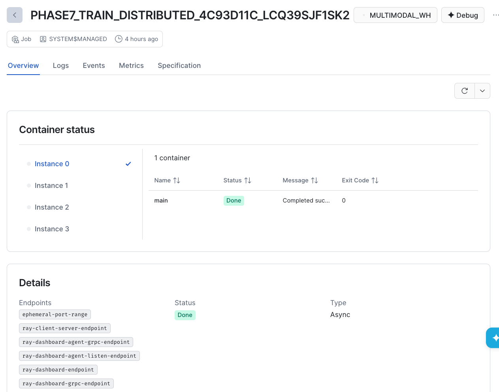

**スクリーンショット** 学習した結果をML Experimentsで確認、比較

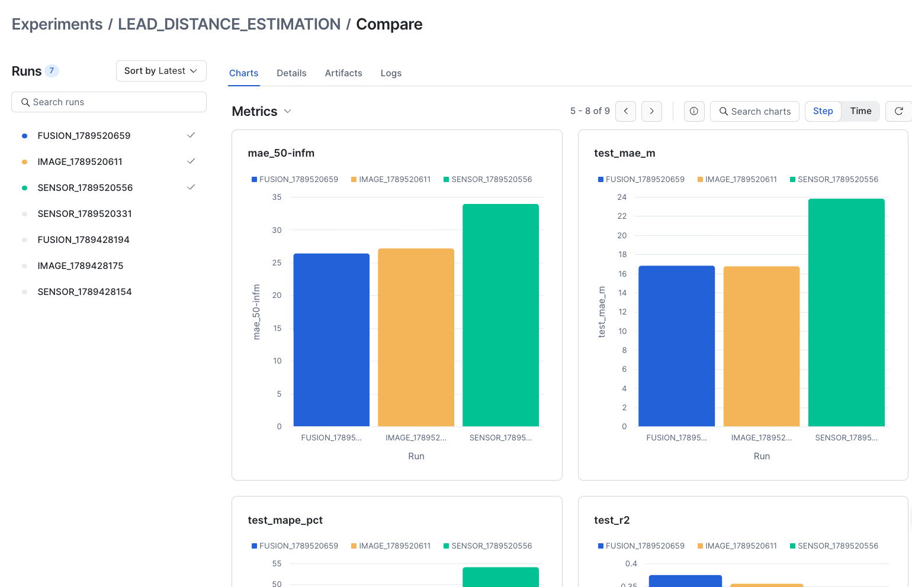

#### Phase 8 — 比較ダッシュボード

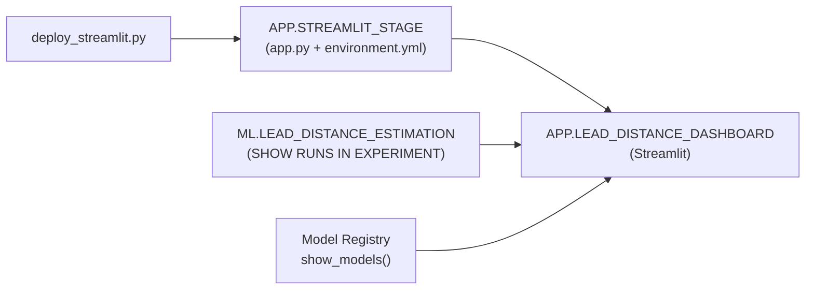
```mermaid
flowchart LR
    EXP["ML.LEAD_DISTANCE_ESTIMATION<br/>(SHOW RUNS IN EXPERIMENT)"]
    REG["Model Registry<br/>show_models()"]
    SCRIPT["deploy_streamlit.py"]
    STAGE["APP.STREAMLIT_STAGE<br/>(app.py + environment.yml)"]
    SL["APP.LEAD_DISTANCE_DASHBOARD<br/>(Streamlit)"]

    SCRIPT --> STAGE
    STAGE --> SL
    EXP --> SL
    REG --> SL
```

```bash
python3 scripts/deploy_streamlit.py
```

- **内容:** `streamlit/app.py` + `streamlit/environment.yml` を `APP.STREAMLIT_STAGE` にアップロードし、その上に `STREAMLIT` オブジェクトを作成します。
  - アプリ自体は Phase 7 が書き込んだ Experiment run と Model Registry のエントリをクエリし、sensor/image/fusion の比較 (テストセットの MAE、R²、そして `speed` を除外している理由) を並べて表示します。
  - Streamlit はそのステージをライブに読むため、`app.py` を編集した後はこのスクリプトを再実行するだけで十分です。
- **結果:** Snowsight の **Projects > Streamlit** から `APP.LEAD_DISTANCE_DASHBOARD` を確認できます。Phase 7 が新しい run を生成するたびに、いつでも再実行して比較結果を更新してください。

**スクリーンショット** (`APP.LEAD_DISTANCE_DASHBOARD`、実際のアカウント): モダリティごとのMAE/R² バー、0-30/30-50/50m+ の距離帯別 MAE テーブル、そしてダッシュボードが各指標をトレースする元になる Experiment run / Model Registry バージョンの一覧です。

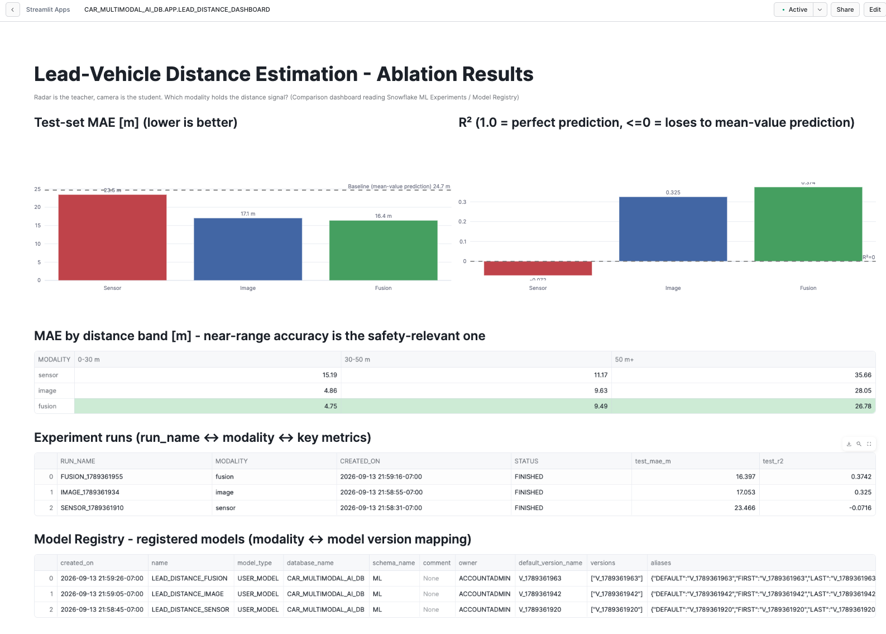

#### Phase 9 — オンライン推論サービング + 推論 UI

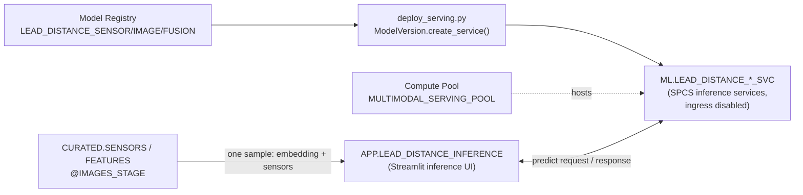
```mermaid
flowchart LR
    REG["Model Registry<br/>LEAD_DISTANCE_SENSOR/IMAGE/FUSION"]
    DEPLOY["deploy_serving.py<br/>ModelVersion.create_service()"]
    SVCPOOL["Compute Pool<br/>MULTIMODAL_SERVING_POOL"]
    SVC["ML.LEAD_DISTANCE_*_SVC<br/>(SPCS inference services,<br/>ingress disabled)"]
    UI["APP.LEAD_DISTANCE_INFERENCE<br/>(Streamlit inference UI)"]
    DATA["CURATED.SENSORS / FEATURES<br/>@IMAGES_STAGE"]

    REG --> DEPLOY
    DEPLOY --> SVC
    SVCPOOL -.->|hosts| SVC
    DATA -->|"one sample: embedding + sensors"| UI
    UI <-->|"predict request / response"| SVC
```

```bash
python3 scripts/deploy_serving.py --dry-run          # モデルバージョンを解決し、計画を表示するだけ
python3 scripts/deploy_serving.py                     # 3 つのモダリティすべてをデプロイ(各~10分のイメージビルド*)
python3 scripts/deploy_serving.py --modality fusion    # 1 つだけデプロイすることも可能
python3 scripts/deploy_streamlit.py --app inference    # 推論 UI をデプロイ
```

- **内容:** `scripts/deploy_serving.py` は Phase 7 が生成した各モデルの最新の登録バージョンを検索し、`ModelVersion.create_service()` を呼び出します。これにより Snowflake がそのモデルバージョン用のコンテナイメージをビルドし、Snowpark Container Services 上で長時間稼働するHTTP 推論サーバーとして実行します。3 つのモダリティすべてをデプロイするため、UI は 1 つの入力を全モデルに送り、その回答を並べて表示できます。
  - サービスは `ingress_enabled=False` で作成されます。唯一のクライアントは Streamlit-in-Snowflake で、アカウント内部から呼び出すため、パブリックエンドポイントやトークン処理は不要です (外部から呼び出したい場合は `--ingress` でパブリック HTTPS エンドポイントを有効化できます)。
  - 各サービスが `RUNNING` になった後、スクリプトはスモークテストを実行し、レーダーの正解値と並べて予測結果を表示します。
  - 続いて `streamlit/inference_app.py` を使うと、テストスプリットのサンプルを選択し、バックボーンが見たクロップ済みフレームを表示し、リクエストを送信して、各モデルの予測距離をレーダーの正解値・往復レイテンシとともに表示できます。
    - **センサーの what-if スライダー** により、7 つの自車運動チャンネルを動かし、各モデルの反応の大きさを比較できます。
      - 例: あるフレームで 7チャンネルすべてを ±1σ 動かした実測値では、sensor-only は基準値 43.5 m に対して最大 9.6 m (約 22%) 動き、image-only は (センサー入力を一切持たないため) **まったく** 動かず、fusion は基準値 86.5 m に対して最大 5.5 m (約 6%) 動きます。つまり fusion はセンサーにも反応しますが、画像によって値がつなぎ留められています。
  - 予測パス (学習時と同じ train split でのセンサー標準化、単一テンソルの入力レイアウト、log-distance の逆変換) は `src/serving.py` に実装されており、単体テスト済みです。この 3 つのいずれかを間違えると、エラーにはならず、それらしく見えるが意味のない数値が出力されてしまうためです。
  - **レイテンシ:** Snowflake 内部からのサービス呼び出しは 1 回あたり約 5〜10 秒かかり、そのほとんどは呼び出しごとの固定オーバーヘッドです (実測: 1 行の推論と 200 行の推論がほぼ同じ時間)。
    - UI は 3 つの呼び出しを並行実行するため、待ち時間は 3 つの合計ではなく最も遅いモデル1 つ分になります。本当に低レイテンシが必要な場合は `--ingress` を付けてデプロイし、サービスのHTTPS エンドポイントを直接呼び出してください。
- **結果:** `MULTIMODAL_SERVING_POOL` 上で稼働する`ML.LEAD_DISTANCE_{SENSOR,IMAGE,FUSION}_SVC` と、Snowsight の **Projects > Streamlit** の`APP.LEAD_DISTANCE_INFERENCE`。
  - **コストに関する注意:** 稼働中の推論サービスがあると、そのコンピュートプールは自動サスペンドされません。デモが終わったらサービスを削除してください (`python3 scripts/deploy_serving.py--drop`)。

**スクリーンショット**(`APP.LEAD_DISTANCE_INFERENCE`、実際のアカウント): エラー列 (`Error vs radar [m]`) には各モデルのレーダー正解値に対する符号付き誤差が表示されます。修正前は `streamlit/inference_app.py` の表示上の小さなバグにより空欄になっていました。

| | |
|---|---|
| 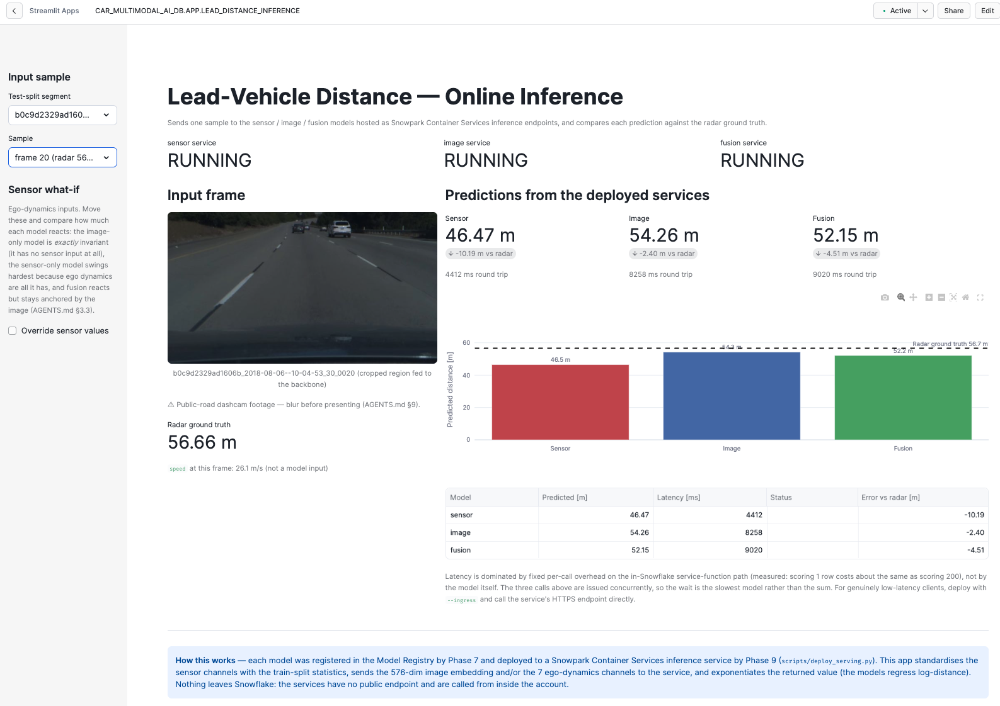 | 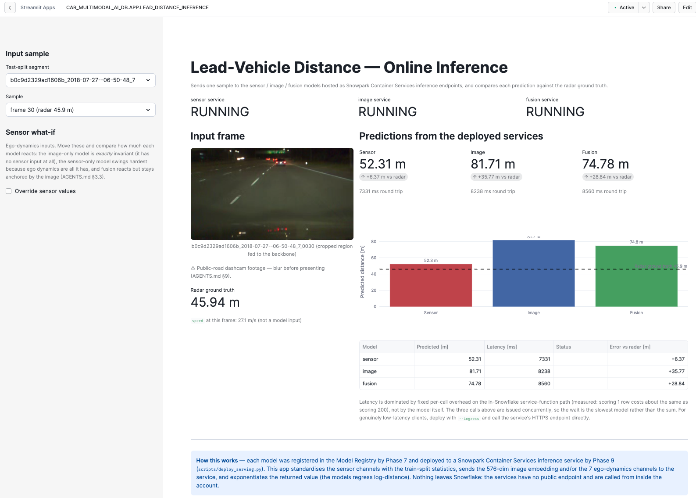 |
| 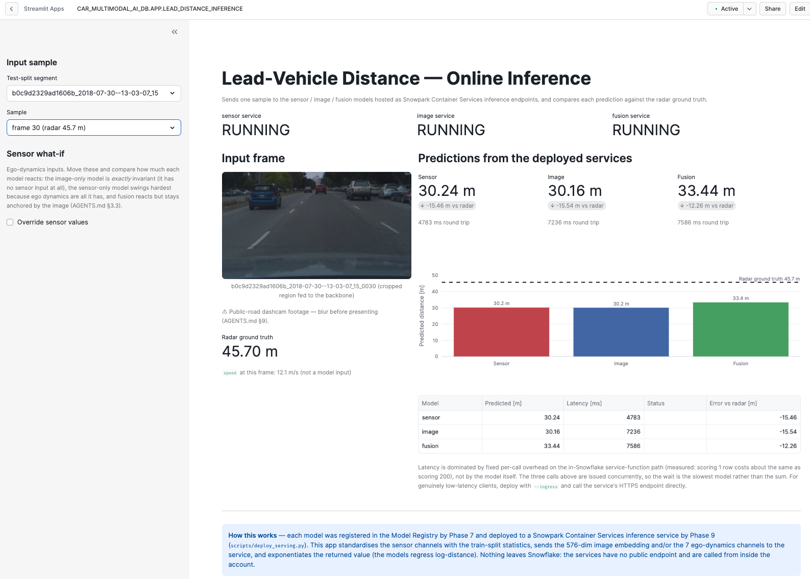 | |

### 3. Teardown — すべてを削除する

**実行方法:**

```bash
python3 scripts/teardown.py            # 確認を求められます
python3 scripts/teardown.py --yes      # 確認をスキップ(CI などの場合)
```

(同等の操作:SQL クライアントで `infra/03_teardown.sql` を直接実行しても構いません。)

- **内容:** このスクリプトは対象のアカウント/ユーザーを表示し、(`--yes` を指定しない限り) 対話的な確認を求めます。
  - まず Phase 9 の推論サービスを削除します (稼働中のサービスがあるとコンピュートプールを削除できないため、これを最初に行います)。
  - 続いて `CAR_MULTIMODAL_AI_DB` (上記で作成したすべてのスキーマ、テーブル、ステージ、Workspace、Streamlit オブジェクト、Experiment、Registry モデルにカスケード)、`MULTIMODAL_WH`、3 つすべてのコンピュートプール、`HF_ACCESS_INTEGRATION`、`MULTIMODAL_APP_ROLE` を削除します。

- **結果:** **このプロジェクトが作成したリソースはすべて削除されます。これは元に戻せません。**

## リポジトリ構成

```
car_multimodal_ai_sample/
├── infra/             # DB/SCHEMA/WAREHOUSE/COMPUTE POOL/外部アクセス/テアダウン
├── jobs/              # ML Jobs として投入されるスクリプト (Phase 1,2,5,7)
├── scripts/           # setup.py / teardown.py + 各フェーズの submit/upload/deploy ラッパー
│                      # deploy_serving.py (Phase 9)、deploy_streamlit.py (Phase 8/9) を含む
├── notebooks/         # Notebooks in Workspaces のソース (Phase 3,4,6) — ML.CAR_MULTIMODAL_AI に push
├── src/               # 共通ライブラリ (data/model/train/evaluate/serving)
├── conf/              # 設定ファイル (prepare.yaml / train.yaml)
├── streamlit/         # app.py = 比較ダッシュボード (Phase 8)、inference_app.py = 推論 UI (Phase 9)
└── tests/             # 合成データに対する単体テスト
```

## データ

- **デフォルトでは `raw_data/Chunk_1.zip` のみ** (8.73GB、約188セグメント) で実行します。
- **フルデータセットへの切り替え**: `conf/prepare.yaml: huggingface.chunks` を `"all"` に設定すると `Chunk_1` から `Chunk_10` まで (合計約94.6GB、約2,019セグメント) を取り込みます。 
  - `jobs/phase1_ingest_raw.py` はチャンクを 1 つずつ処理するため、ディスク使用量のピークは概ね 1 チャンク分に留まります。
  - 切り替える前にコストや実行時間への影響を確認し、その規模で Phase 7 のデフォルトの4ノードDDPで十分か、`--nodes` をさらに増やす必要があるか再検証してください。

## ライセンス
- データ: [comma2k19](https://huggingface.co/datasets/commaai/comma2k19)(comma.ai、MIT)
- このリポジトリのコード: Apache License 2.0(リポジトリルートの [`LICENSE`](../../LICENSE) を参照)

## セキュリティ

このリポジトリには Snowflake の認証情報や API キーは含まれていません。接続情報はローカルの
`connections.toml` / 環境変数で管理し、絶対にコミットしないでください (`.gitignore` を参照)。

## Reference URL

本プロジェクトが利用している製品・データセット・ライブラリの公式ドキュメントです。

### Snowflake

- [Snowflake ML の概要](https://docs.snowflake.com/ja/developer-guide/snowflake-ml/overview) — 以下すべての土台となる機能群
- [ML Jobs](https://docs.snowflake.com/ja/developer-guide/snowflake-ml/ml-jobs/overview) — Phase 1、2、5、7 で使う `submit_directory()`
- [マルチノード ML Jobs](https://docs.snowflake.com/ja/developer-guide/snowflake-ml/ml-jobs/distributed-ml-jobs) — `target_instances`、Ray クラスタ、`PyTorchDistributor` (Phase 2、5、7)
- [Container Runtime for ML](https://docs.snowflake.com/ja/developer-guide/snowflake-ml/container-runtime-ml) — ML Jobs と Notebook が実行されるランタイム
- [Snowflake Notebooks](https://docs.snowflake.com/ja/user-guide/ui-snowsight/notebooks) / [Container Runtime 上の Notebooks](https://docs.snowflake.com/ja/user-guide/ui-snowsight/notebooks-on-spcs) — Phase 3、4、6
- [Workspaces](https://docs.snowflake.com/ja/user-guide/ui-snowsight/workspaces) — `scripts/upload_notebooks.py` が Notebook を push する `ML.CAR_MULTIMODAL_AI`
- [ML Experiments](https://docs.snowflake.com/ja/developer-guide/snowflake-ml/experiments) — Phase 7 の実験管理と、Phase 8 のダッシュボードの参照元
- [Model Registry](https://docs.snowflake.com/ja/developer-guide/snowflake-ml/model-registry/overview) — `log_model()` とモデルのバージョン管理 (Phase 7、8)
- [Snowpark Container Services でのモデルサービング](https://docs.snowflake.com/ja/developer-guide/snowflake-ml/model-registry/container) — `ModelVersion.create_service()` (Phase 9)
- [Snowpark Container Services](https://docs.snowflake.com/ja/developer-guide/snowpark-container-services/overview) / [コンピュートプール](https://docs.snowflake.com/ja/developer-guide/snowpark-container-services/working-with-compute-pool) — Job・Notebook・推論サービスの実行基盤
- [Streamlit in Snowflake](https://docs.snowflake.com/ja/developer-guide/streamlit/about-streamlit) — Phase 8 の比較ダッシュボードと Phase 9 の推論 UI
- [外部ネットワークアクセス](https://docs.snowflake.com/ja/developer-guide/external-network-access/external-network-access-overview) / [CREATE NETWORK RULE](https://docs.snowflake.com/ja/sql-reference/sql/create-network-rule) / [CREATE EXTERNAL ACCESS INTEGRATION](https://docs.snowflake.com/ja/sql-reference/sql/create-external-access-integration) — `infra/02_external_access.sql` (Hugging Face / PyPI / PyTorch Hub への egress)
- [Snowpark Python](https://docs.snowflake.com/ja/developer-guide/snowpark/python/index) / [snowflake-ml-python API リファレンス](https://docs.snowflake.com/ja/developer-guide/snowpark-ml/reference/latest/index) — 本リポジトリの各スクリプトが呼び出すクライアント API
- [Snowflake 接続の設定 (`connections.toml`)](https://docs.snowflake.com/ja/developer-guide/snowflake-cli/connecting/configure-connections) — `SNOWFLAKE_CONNECTION_NAME` が参照する設定

### データセット

- [Hugging Face 上の comma2k19](https://huggingface.co/datasets/commaai/comma2k19) — Phase 1 で取り込むデータセット
- [commaai/comma2k19 (GitHub)](https://github.com/commaai/comma2k19) — Phase 2 がパースするログ形式と `processed_log/` / `global_pose/` の構成
- [「A Commute in Data: The comma2k19 Dataset」(arXiv:1812.05752)](https://arxiv.org/abs/1812.05752) — データセットの論文

### ライブラリ

- [PyTorch DistributedDataParallel](https://pytorch.org/docs/stable/notes/ddp.html) / [DDP チュートリアル](https://pytorch.org/tutorials/intermediate/ddp_tutorial.html) — Phase 7 の学習基盤
- [torchvision MobileNetV3](https://pytorch.org/vision/stable/models/mobilenetv3.html) — Phase 5 の凍結済み埋め込みバックボーン
- [Ray](https://docs.ray.io/en/latest/index.html) / [Ray Data](https://docs.ray.io/en/latest/data/data.html) — セグメント単位の remote task (Phase 2) と `read_datasource()` / `map_batches()` (Phase 5)
- [PyAV](https://pyav.org/docs/stable/) — Phase 2 の HEVC デコード
- [Streamlit](https://docs.streamlit.io/) — `streamlit/` 配下の 2 つのアプリ
- [huggingface_hub](https://huggingface.co/docs/huggingface_hub/index) — Phase 1 の `hf_hub_download()`
- [uv](https://docs.astral.sh/uv/) — ローカル環境のセットアップ
