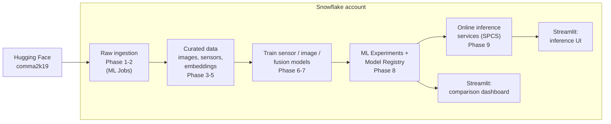
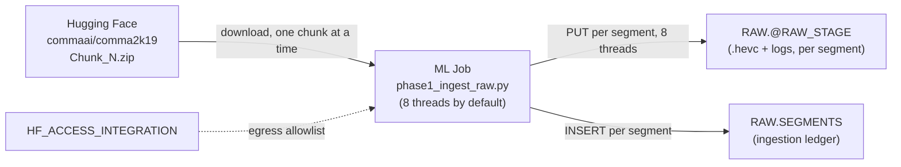
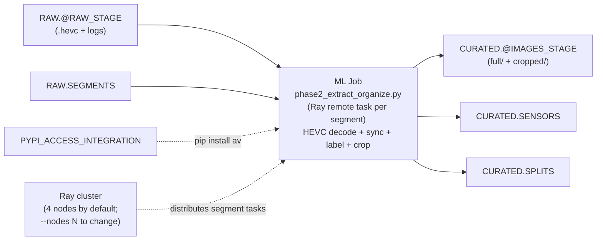
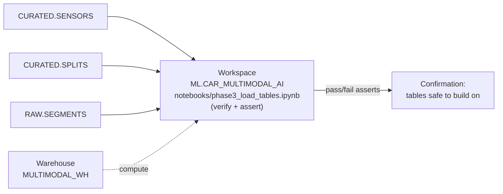
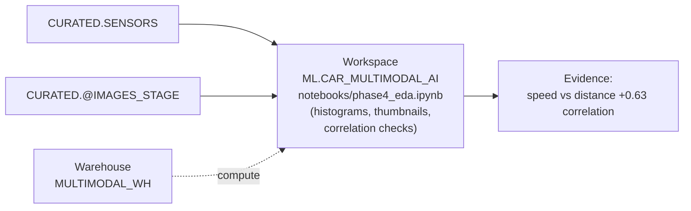
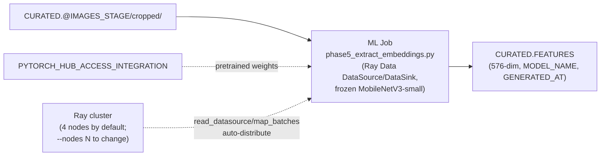
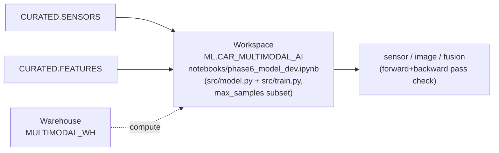
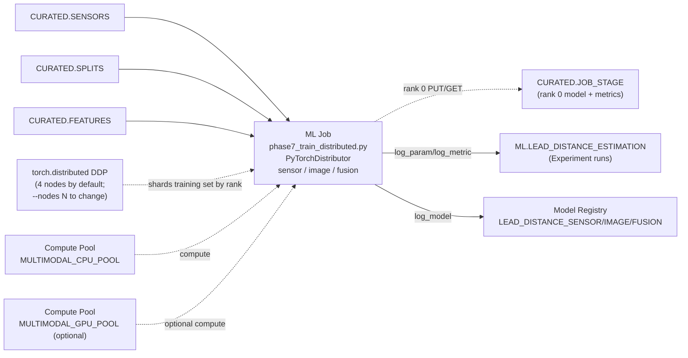
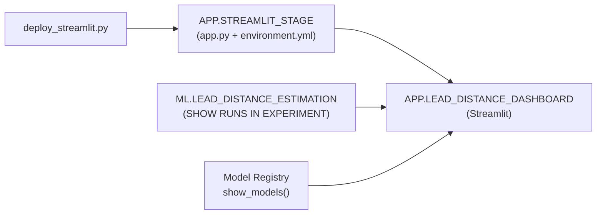
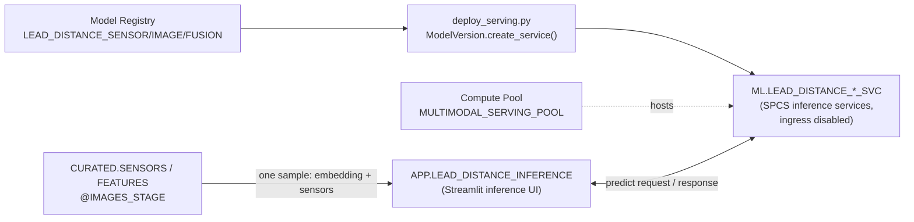

# Automotive Multimodal AI Development

[日本語](./README.ja.md)

**An end-to-end automotive multimodal AI development flow that runs entirely on Snowflake**

Ingests the [comma2k19](https://huggingface.co/datasets/commaai/comma2k19) dataset (comma.ai, MIT license, public dataset) from Hugging Face into Snowflake, then runs nine phases end-to-end: data extraction, organization, visualization, feature extraction, multimodal training, distributed training, experiment tracking, model registration, a comparison dashboard, and online inference serving.

> We train an AI model that estimates the distance to the lead vehicle from front-camera footage and sensors, using radar range measurements as ground-truth labels. We verify that combining sensor data with images improves model accuracy.
> This is a reference implementation that reproduces multimodal AI development on Snowflake.

---

## Purpose

- This project's goal is to walk through, with runnable sample code, how to build an AI model on a multimodal dataset entirely on Snowflake.
- The dataset is [comma2k19](https://huggingface.co/datasets/commaai/comma2k19) from Hugging Face (comma.ai, MIT license, public dataset).
- comma2k19 is a public autonomous-driving dataset recording roughly 33 hours of driving on California's Highway 280. It was collected with comma.ai's in-car device, the "comma EON", and the following are recorded time-synchronized:
  - front-camera video (20Hz)
  - GPS
  - IMU (accelerometer/gyroscope)
  - steering angle, speed, and radar-based lead-vehicle distance/relative-speed, all read over the vehicle's OBD-II/CAN bus
- The full dataset is split into one-minute "segments" (`raw_data/Chunk_1.zip` through `Chunk_10.zip`, ~2,019 segments totaling ~94.6GB); this project defaults to `Chunk_1` only (188 segments, 8.73GB).


- Example data (a subset of `CURATED.SENSORS` columns; one row = one frame):

  | SEGMENT_ID | FRAME_IDX | T [s] | DISTANCE (radar lead-vehicle distance) [m] | STEERING_ANGLE [deg] | ACCEL_X/Y/Z [m/s²] | SPLIT |
  |---|---|---|---|---|---|---|
  | b0c9d2329ad1606b_2018-07-27--06-03-57_10 | 248 | 12.4 | 43.2 | -2.1 | 0.12 / -0.03 / 9.79 | train |
  | b0c9d2329ad1606b_2018-07-27--06-03-57_10 | 600 | 30.0 | 9.8 | 15.4 | -0.85 / 0.21 / 9.81 | train |
  | b0c9d2329ad1606b_2018-07-27--06-03-57_11 | 912 | 45.6 | 91.5 | 0.3 | 0.02 / 0.00 / 9.80 | test |


- Through this project, we aim to learn:
  - How to ingest raw multimodal data such as video and sensor logs into Snowflake from an external source (Hugging Face) via an External Access Integration (Phase 1)
  - Implementation patterns for scaling large-video (HEVC) decoding and sensor-log sync/label generation with distributed processing using ML Jobs / Ray (choosing between multi-node and multi-thread, Phase 2)
  - A data-quality-check / EDA (visualization) workflow using Notebooks in Workspaces (Phase 3, 4)
  - Distributed execution of image-embedding extraction with a pretrained backbone model (Phase 5)
  - Designing three models — sensor-only, image-only, and sensor+image fusion — and the "ablation" mindset and practice of comparing their accuracy (Phase 6, 7)
  - Implementing real distributed training (`torch.distributed` DDP) with `PyTorchDistributor` (Phase 7)
  - Tracking training experiments with ML Experiments and versioning models with Model Registry (Phase 8)
  - Building a results-comparison dashboard in Streamlit (Phase 8)
  - Serving a trained model for online inference with Snowpark Container Services (SPCS), and calling it live from a UI (Phase 9)

---

## Architecture



The nine phases are consolidated into four Snowflake building blocks:
1. **Ingest and curate** the raw dataset (Phase 1-5)
2. **Train** the three ablation models (Phase 6-7)
3. **Track and register** them (Phase 8)
4. Review them in a **comparison dashboard**, and serve them as **online inference** (Phase 9)

That is the overall flow.

For each phase's detailed design, table/stage names, compute-pool assignments and so on, see the per-phase walkthrough below.

## Prerequisites

- A Snowflake account (with Container Runtime Notebooks / ML Jobs / SPCS available)
  - **Minimum edition: Enterprise Edition or higher.**
  - Snowpark Container Services (compute pools / `CREATE SERVICE`, used by every ML Job in Phase 1/2/5/7, by Notebooks in Workspaces in Phase 3/4/6, and by Phase 9's model-serving) is not available on Standard Edition — `CREATE COMPUTE POOL` fails there. A standard 30-day Snowflake trial account defaults to Enterprise Edition, so it satisfies this requirement out of the box; only an explicitly-downgraded Standard Edition account would not.
  - Confirm the current [SPCS edition requirement](https://docs.snowflake.com/en/developer-guide/snowpark-container-services/overview) before running, since edition requirements can change.
- `ACCOUNTADMIN`-equivalent privileges (for the initial infra setup only)
- Locally: Python 3.11+, [`uv`](https://docs.astral.sh/uv/)
- Snowflake connection info: a connection configured via `cortex connections`, or `~/.snowflake/connections.toml`

( **This project is designed not to depend on any specific account name.** )

## Setup

```bash
uv venv --python 3.11 ~/.venvs/car_multimodal_ai_sample
uv pip install --python ~/.venvs/car_multimodal_ai_sample -e ".[dev]"
source ~/.venvs/car_multimodal_ai_sample/bin/activate
```

> **Create the virtualenv *outside* the project root** (not `./.venv`).
> The ML Job submission path copies only a filtered part of the project (`jobs/` + `src/` + `conf/` only, see `scripts/_submit_common.py`), so a venv inside the repo is no longer fatal — but keeping a multi-GB dependency tree outside the project directory avoids unexpected collisions with any tool that walks it.

The following environment variable is assumed:

```bash
# works with cortex connections or ~/.snowflake/connections.toml
export SNOWFLAKE_CONNECTION_NAME=<your-connection>
```

All commands below are run **from the project root**.

### 1. Setup — build the infrastructure (one-time, ACCOUNTADMIN)

**How to start:**

```bash
python3 scripts/setup.py
```

**What's happening**

- `infra/01_setup_database.sql` creates the database, warehouse, compute pools, role, and every stage the later phases write to. `infra/02_external_access.sql` creates the network rule + External Access Integration that lets ML Jobs/Notebooks reach Hugging Face (dataset download), PyPI (`pip_requirements` in ML Jobs), and PyTorch Hub (Phase 5's pretrained backbone weights). Every statement is `CREATE ... IF NOT EXISTS`, so this script is idempotent. Re-running it after a partial failure, or to pick up a project update, is safe.
- Equivalently: you may run `infra/01_setup_database.sql` and then `infra/02_external_access.sql` in a Snowsight Worksheet or any SQL client. `scripts/setup.py` just executes those two files programmatically via Snowpark, statement by statement, and prints each result.

**Outcome:** the objects below are created in your account, all owned by `MULTIMODAL_APP_ROLE`.

| Object | Name |
|---|---|
| Database | `CAR_MULTIMODAL_AI_DB` (schemas: `RAW`/`CURATED`/`ML`/`APP`) |
| Warehouse | `MULTIMODAL_WH` |
| Compute Pool | `MULTIMODAL_CPU_POOL` (required) / `MULTIMODAL_GPU_POOL` (optional) |
| Role | `MULTIMODAL_APP_ROLE` |
| Stages | `RAW.RAW_STAGE`, `CURATED.IMAGES_STAGE`, `CURATED.FEATURES_STAGE`, `CURATED.MISC_STAGE`, `CURATED.JOB_STAGE` |
| Workspace | `ML.CAR_MULTIMODAL_AI` (Phase 3/4/6 Notebooks in Workspaces) |
| External Access | `HF_ACCESS_INTEGRATION`, `PYPI_ACCESS_INTEGRATION`, `PYTORCH_HUB_ACCESS_INTEGRATION` |

Note that nothing else in this README depends on account-specific values. The same commands can be run on any Snowflake account with Container Runtime Notebooks / ML Jobs / SPCS enabled.

### 2. Run the phases

Run each phase in order. Every `jobs/*.py` script and `scripts/submit_phase*.py` wrapper supports `--dry-run` (processes only a handful of segments/samples). Verify with a dry run before a production run as needed.

**Submitting ML Jobs** (Phase 1, 2, 5, 7): `scripts/submit_phase*.py` call `snowflake-ml-python`'s Python API (`submit_directory`) directly. Command execution is asynchronous by default (add `--wait` to block until completion and print logs). To check status after submission, use `job.get_logs()` or the Snowsight Jobs page.

**Using Notebooks in Workspaces** (Phase 3, 4, 6): `scripts/upload_notebooks.py` PUTs each `.ipynb` file (plus the `src/`/`conf/` it imports) into the `ML.CAR_MULTIMODAL_AI` workspace's live version and commits it. To run a notebook, open the `.ipynb` file directly from Snowsight (Projects > Workspaces > CAR_MULTIMODAL_AI > notebooks/) and run it there.

#### Phase 1 — Ingest raw data



```bash
python3 scripts/submit_phase1.py --dry-run --limit 3   # sanity check: 3 segments only
python3 scripts/submit_phase1.py                        # default: all 188 segments with 8 threads (~3-4 min*)
python3 scripts/submit_phase1.py --concurrency 1         # sequential staging (no threading)
```

- **What's happening:** `jobs/phase1_ingest_raw.py` downloads `Chunk_1.zip` (or whichever chunks `conf/prepare.yaml: huggingface.chunks` selects) from Hugging Face, unzips it segment by segment, and pushes each segment's `.hevc` + `processed_log/` + `global_pose/` files to `@RAW_STAGE`.
  - Chunks are processed one at a time (download → unzip → stage → delete local copy → next chunk), so peak local disk usage stays bounded to one chunk's size even with `chunks: "all"`.
  - **Staging segments within a chunk is multi-threaded by default**: each segment's PUT calls are I/O-bound work dominated by waiting on network uploads, so a thread pool gives a real wall-clock win inside a single container with no extra compute-pool nodes needed (`--concurrency N`, default 8).
  - Each worker thread opens its own Snowpark session, since the shared driver session isn't safe for concurrent use across threads.
  - Pass `--concurrency 1` for strictly sequential staging.
- **Outcome:** `RAW.RAW_STAGE` is populated with one folder per segment. `RAW.SEGMENTS` (a ledger table) records each segment's ingestion status, used by later phases to skip corrupt segments.
- Note: this write **appends**, so re-running this phase against an account that already has `SEGMENTS` data will duplicate rows. Truncate the table first if you need a clean re-run.

#### Phase 2 — Extract & organize



```bash
python3 scripts/submit_phase2.py --dry-run --limit 3
python3 scripts/submit_phase2.py                          # default: 4-node Ray cluster, auto-distributed
python3 scripts/submit_phase2.py --nodes 1                 # single-node run (no multi-node distribution)
```

- **What's happening:** `jobs/phase2_extract_organize.py` extracts each segment's data. Specifically, it decodes the HEVC video, syncs CAN/IMU sensor logs to camera timestamps, generates radar-based lead-vehicle-distance labels, crops frames to the lower-center region (rows 0.40–0.82, cols 0.22–0.78), and stages the resulting images to `@IMAGES_STAGE` (`full/` and `cropped/`).
  - Each segment is submitted as a Ray remote task. **By default this requests 4 `MULTIMODAL_CPU_POOL` nodes** (`--nodes N`, mapped to `submit_directory(..., target_instances=N)`), and Ray's scheduler spreads the per-segment tasks across all of them.
  - Each task opens its own Snowpark session rather than sharing the driver's, since sessions aren't safe to pickle across worker processes.
  - Pass `--nodes 1` for a single-node run.
- **Outcome:** `CURATED.IMAGES_STAGE` holds every frame, and `CURATED.SENSORS` (per-frame sensor readings + distance label) and `CURATED.SPLITS` (train/val/test assignment per segment) are created via `write_pandas(auto_create_table=True)`.
- Note: this write uses `overwrite=False` (append), so re-running this phase against an account that already has `SENSORS`/`SPLITS` data will duplicate rows. Drop both tables first if you need a clean re-run.

**Screenshot** inspecting the extracted data


#### Phase 3 — Finalize table registration



```bash
python3 scripts/upload_notebooks.py --phase 3
```

Then open **Projects > Workspaces > CAR_MULTIMODAL_AI > notebooks/phase3_load_tables.ipynb** in Snowsight and run all cells.

- **What's happening:** the notebook queries `CURATED.SENSORS`/`CURATED.SPLITS` and checks them against the acceptance criteria.
  - The train/val/test split ratio is roughly 70/15/15.
  - The distance-label distribution matches median 47.8 m, p10 = 9.0 m, range 3.0–149.8 m (measured in advance).
  - The valid-label rate is within ±5pt of 77.8%.
- **Outcome:** the notebook's asserts confirm that Phase 2's output tables are correct and safe to build on.

#### Phase 4 — Data visualization / EDA



```bash
python3 scripts/upload_notebooks.py --phase 4
```

Then open **Projects > Workspaces > CAR_MULTIMODAL_AI > notebooks/phase4_eda.ipynb** in Snowsight and run all cells.

- **What's happening:** the notebook plots a histogram of the distance label, displays a thumbnail gallery of sample frames next to their radar distance, checks sensor-channel-to-distance correlations (reproducing the +0.63 correlation between `speed` and distance), and plots the valid-label rate per segment to spot low-quality outliers.
- **Outcome:** visual confirmation that the data is reasonable, plus the concrete evidence (`speed` +0.63 correlation) for why Phase 6/7 exclude `speed` from the sensor branch's training inputs.

**Screenshot** an example of the EDA output


#### Phase 5 — Extract image embeddings



```bash
python3 scripts/submit_phase5.py --dry-run --limit 20
python3 scripts/submit_phase5.py                          # default: 4-node Ray cluster, auto-distributed
python3 scripts/submit_phase5.py --nodes 1                 # single-node run (no multi-node distribution)
```

- **What's happening:** `jobs/phase5_extract_embeddings.py` reads every cropped frame directly from `@IMAGES_STAGE/cropped/` in parallel, runs each through an ImageNet-pretrained MobileNetV3-small backbone (classifier head removed), and produces a 576-dim feature vector per frame.
  - **By default it requests 4 `MULTIMODAL_CPU_POOL` nodes** (`--nodes N`, mapped to `submit_directory(..., target_instances=N)`). `ray.data.read_datasource()` / `.map_batches()` already spread work across every node in the cluster automatically.
  - Pass `--nodes 1` for a single-node run.
- **Outcome:** `CURATED.FEATURES` (576-dim float embeddings, one row per sample, with `MODEL_NAME`/`GENERATED_AT` provenance columns) is the data used for training in Phase 6 and 7.

**Screenshot** the extracted feature vectors


#### Phase 6 — Model development (small-scale validation)



```bash
python3 scripts/upload_notebooks.py --phase 6
```

Then open **Projects > Workspaces > CAR_MULTIMODAL_AI > notebooks/phase6_model_dev.ipynb** in Snowsight and run all cells.

- **What's happening:** the notebook defines all three ablation models in `src/model.py` (sensor-only, image-only, sensor-image fusion) and runs training (`src.train.run()`) for each on a small subset (`max_samples`, a few hundred rows). This only goes far enough to confirm that the forward/backward passes complete cleanly and the loss decreases within seconds to tens of seconds.
- **Outcome:** confirmation that all 3 modalities train without error on this notebook's Container Runtime, plus reference metrics on that subset.

#### Phase 7 — Full-scale distributed training



```bash
python3 scripts/submit_phase7.py --dry-run --max-samples 500
python3 scripts/submit_phase7.py                          # default: real DDP across 4 nodes, all 3 modalities
python3 scripts/submit_phase7.py --modality fusion         # or run a single modality
python3 scripts/submit_phase7.py --nodes 1                 # single-node smoke test (no DDP)
```

- **What's happening:** `jobs/phase7_train_distributed.py` trains all three ablation conditions on the full dataset.
  - **By default it trains with real `torch.distributed` DDP across 4 nodes** (`conf/train.yaml: distributed.num_nodes: 4`, overridable via `--nodes N`, mapped to `submit_directory(..., target_instances=N)`)
  - Every worker builds its own Snowpark session and trains on a disjoint shard of the training set, and DDP all-reduces gradients every step so all ranks' models stay in sync. Since worker nodes don't share a filesystem with the driver, rank 0 alone PUTs the trained model + metrics directly to `CURATED.JOB_STAGE`, and the driver GETs them back afterward before logging to Experiments/Registry.
  - Pass `--nodes 1` to fall back to a single-node run (each modality trains directly in the driver process, with no Ray/DDP orchestration).
  - Each run's parameters / metrics are logged to a Snowflake ML Experiment, and each trained model is registered in the Model Registry.
- **Outcome:** three logged runs under Experiment `ML.LEAD_DISTANCE_ESTIMATION`, and three registered models: `ML.LEAD_DISTANCE_SENSOR`, `ML.LEAD_DISTANCE_IMAGE`, `ML.LEAD_DISTANCE_FUSION`.
  - Measured results (Chunk_1, 188 segments, 4-node DDP): fusion is expected to beat both single-modality baselines on both MAE and R².

**Screenshot** distributed training via ML Jobs


**Screenshot** reviewing and comparing the trained results in ML Experiments


#### Phase 8 — Comparison dashboard



```bash
python3 scripts/deploy_streamlit.py
```

- **What's happening:** uploads `streamlit/app.py` + `streamlit/environment.yml` to `APP.STREAMLIT_STAGE` and creates the `STREAMLIT` object on top of it.
  - The app itself queries the Experiment runs and Model Registry entries that Phase 7 wrote, and renders a side-by-side sensor/image/fusion comparison (test-set MAE, R², and why `speed` is excluded).
  - Because Streamlit reads its stage live, re-running this script after editing `app.py` is enough.
- **Outcome:** `APP.LEAD_DISTANCE_DASHBOARD`, viewable in Snowsight under **Projects > Streamlit**. Re-run it any time Phase 7 produces new runs, to refresh the comparison.

**Screenshot** (`APP.LEAD_DISTANCE_DASHBOARD`, live account): MAE/R² bars per modality, the 0-30/30-50/50m+ banded MAE table, and the Experiment run / Model Registry version listings the dashboard traces each metric back to.


#### Phase 9 — Online inference serving + inference UI



```bash
python3 scripts/deploy_serving.py --dry-run          # just resolve model versions and print the plan
python3 scripts/deploy_serving.py                     # deploy all 3 modalities (~10 min image build each*)
python3 scripts/deploy_serving.py --modality fusion    # or deploy just one
python3 scripts/deploy_streamlit.py --app inference    # deploy the inference UI
```

- **What's happening:** `scripts/deploy_serving.py` looks up the latest registered version of each model Phase 7 produced and calls `ModelVersion.create_service()`, which has Snowflake build a container image for that model version and run it as a long-lived HTTP inference server on Snowpark Container Services. All three modalities are deployed, so the UI can send one input to all of them and show their answers side by side.
  - Services are created with `ingress_enabled=False`. The only client is Streamlit-in-Snowflake, which calls them from inside the account, so no public endpoint or token handling is needed (use `--ingress` to enable a public HTTPS endpoint if you want to call them from outside).
  - After each service reports `RUNNING`, the script runs a smoke test and prints the predictions next to the radar ground truth.
  - `streamlit/inference_app.py` then lets you pick a test-split sample, shows the cropped frame that the backbone saw, sends the request, and displays each model's predicted distance against the radar ground truth with round-trip latency.
    - **Sensor what-if sliders** let you push the 7 ego-dynamics channels around and compare how much each model reacts.
      - Example: measured on one frame at ±1σ on all 7 channels, sensor-only moves up to 9.6 m off a 43.5 m base (~22%), image-only does **not** move at all (it has no sensor input whatsoever), and fusion moves up to 5.5 m off an 86.5 m base (~6%). In other words, fusion reacts to sensors but stays anchored by the image.
  - The prediction path (train-split sensor standardisation, the single-tensor input layout, log-distance inversion) lives in `src/serving.py` and is unit-tested, because getting any of the three wrong yields plausible-looking but meaningless numbers rather than an error.
  - **Latency:** an in-Snowflake service call costs ~5-10 s, almost entirely fixed per-call overhead (measured: scoring 1 row costs about the same as scoring 200 rows).
    - The UI issues its three calls concurrently, so the wait is the slowest single model rather than the sum of all three. If you need genuinely low latency, deploy with `--ingress` and call the service's HTTPS endpoint directly.
- **Outcome:** `ML.LEAD_DISTANCE_{SENSOR,IMAGE,FUSION}_SVC` running on `MULTIMODAL_SERVING_POOL`, and `APP.LEAD_DISTANCE_INFERENCE` in Snowsight under **Projects > Streamlit**.
  - **Cost note:** a live inference service keeps its compute pool from auto-suspending. Drop the services when you're done demoing (`python3 scripts/deploy_serving.py --drop`).

**Screenshots** (`APP.LEAD_DISTANCE_INFERENCE`, live account): the error column (`Error vs radar [m]`) shows each model's signed error vs. the radar ground truth. It was empty until a small display bug in `streamlit/inference_app.py` was fixed.

| | |
|---|---|
|  |  |
|  | |

### 3. Teardown — remove everything

**How to start:**

```bash
python3 scripts/teardown.py            # prompts for confirmation
python3 scripts/teardown.py --yes      # skip the prompt (e.g. CI)
```

(Equivalently: you may run `infra/03_teardown.sql` directly in a SQL client.)

- **What's happening:** the script prints the target account/user and asks for interactive confirmation (unless `--yes` is given).
  - It first drops the Phase 9 inference services (this comes first, because a compute pool with live services can't be dropped).
  - It then drops `CAR_MULTIMODAL_AI_DB` (cascading to every schema, table, stage, Workspace, Streamlit object, Experiment, and Registry model created above), `MULTIMODAL_WH`, all three compute pools, `HF_ACCESS_INTEGRATION`, and `MULTIMODAL_APP_ROLE`.

- **Outcome:** **every resource this project created is deleted. This is irreversible.**

## Repository layout

```
car_multimodal_ai_sample/
├── infra/             # DB/SCHEMA/WAREHOUSE/COMPUTE POOL/external access/teardown
├── jobs/              # scripts submitted as ML Jobs (Phase 1,2,5,7)
├── scripts/           # setup.py / teardown.py + per-phase submit/upload/deploy wrappers
│                      # incl. deploy_serving.py (Phase 9) and deploy_streamlit.py (Phase 8/9)
├── notebooks/         # Notebooks in Workspaces source (Phase 3,4,6) — pushed to ML.CAR_MULTIMODAL_AI
├── src/               # shared library (data/model/train/evaluate/serving)
├── conf/              # configuration (prepare.yaml / train.yaml)
├── streamlit/         # app.py = comparison dashboard (Phase 8), inference_app.py = inference UI (Phase 9)
└── tests/             # unit tests against synthetic data
```

## Data

- **By default, it runs on `raw_data/Chunk_1.zip` only** (8.73GB, ~188 segments).
- **Switching to the full dataset**: set `conf/prepare.yaml: huggingface.chunks` to `"all"` to ingest `Chunk_1` through `Chunk_10` (~94.6GB total, ~2,019 segments).
  - `jobs/phase1_ingest_raw.py` processes chunks one at a time, so peak disk usage stays at roughly one chunk's worth.
  - Before switching, review the cost/runtime implications and re-validate whether Phase 7's default 4-node DDP is still enough at that scale, or whether `--nodes` needs to go higher.

## License
- Data: [comma2k19](https://huggingface.co/datasets/commaai/comma2k19) (comma.ai, MIT)
- This repository's code: Apache License 2.0 (see the repository root [`LICENSE`](../../LICENSE))

## Security

This repository contains no Snowflake credentials or API keys. Manage connection info via a
local `connections.toml` / environment variables, and never commit them (see `.gitignore`).

## Reference URL

Official documentation for the products, datasets, and libraries this project builds on.

### Snowflake

- [Snowflake ML overview](https://docs.snowflake.com/en/developer-guide/snowflake-ml/overview) — the umbrella over everything below
- [ML Jobs](https://docs.snowflake.com/en/developer-guide/snowflake-ml/ml-jobs/overview) — `submit_directory()`, used by Phase 1, 2, 5, 7
- [Multi-node ML Jobs](https://docs.snowflake.com/en/developer-guide/snowflake-ml/ml-jobs/distributed-ml-jobs) — `target_instances`, the Ray cluster, and `PyTorchDistributor` (Phase 2, 5, 7)
- [Container Runtime for ML](https://docs.snowflake.com/en/developer-guide/snowflake-ml/container-runtime-ml) — the runtime the ML Jobs and notebooks execute on
- [Snowflake Notebooks](https://docs.snowflake.com/en/user-guide/ui-snowsight/notebooks) / [Notebooks on Container Runtime](https://docs.snowflake.com/en/user-guide/ui-snowsight/notebooks-on-spcs) — Phase 3, 4, 6
- [Workspaces](https://docs.snowflake.com/en/user-guide/ui-snowsight/workspaces) — `ML.CAR_MULTIMODAL_AI`, where `scripts/upload_notebooks.py` pushes the notebooks
- [ML Experiments](https://docs.snowflake.com/en/developer-guide/snowflake-ml/experiments) — Phase 7's run tracking and Phase 8's dashboard source
- [Model Registry](https://docs.snowflake.com/en/developer-guide/snowflake-ml/model-registry/overview) — `log_model()` and model versioning (Phase 7, 8)
- [Model Serving in Snowpark Container Services](https://docs.snowflake.com/en/developer-guide/snowflake-ml/model-registry/container) — `ModelVersion.create_service()` (Phase 9)
- [Snowpark Container Services](https://docs.snowflake.com/en/developer-guide/snowpark-container-services/overview) / [compute pools](https://docs.snowflake.com/en/developer-guide/snowpark-container-services/working-with-compute-pool) — where jobs, notebooks, and inference services actually run
- [Streamlit in Snowflake](https://docs.snowflake.com/en/developer-guide/streamlit/about-streamlit) — the Phase 8 dashboard and the Phase 9 inference UI
- [External network access](https://docs.snowflake.com/en/developer-guide/external-network-access/external-network-access-overview) / [CREATE NETWORK RULE](https://docs.snowflake.com/en/sql-reference/sql/create-network-rule) / [CREATE EXTERNAL ACCESS INTEGRATION](https://docs.snowflake.com/en/sql-reference/sql/create-external-access-integration) — `infra/02_external_access.sql` (Hugging Face / PyPI / PyTorch Hub egress)
- [Snowpark Python](https://docs.snowflake.com/en/developer-guide/snowpark/python/index) / [snowflake-ml-python API reference](https://docs.snowflake.com/en/developer-guide/snowpark-ml/reference/latest/index) — the client APIs every script in this repo calls
- [Configuring Snowflake connections (`connections.toml`)](https://docs.snowflake.com/en/developer-guide/snowflake-cli/connecting/configure-connections) — what `SNOWFLAKE_CONNECTION_NAME` resolves against

### Dataset

- [comma2k19 on Hugging Face](https://huggingface.co/datasets/commaai/comma2k19) — what Phase 1 ingests
- [commaai/comma2k19 (GitHub)](https://github.com/commaai/comma2k19) — log format and the `processed_log/` / `global_pose/` layout Phase 2 parses
- ["A Commute in Data: The comma2k19 Dataset" (arXiv:1812.05752)](https://arxiv.org/abs/1812.05752) — the dataset paper

### Libraries

- [PyTorch DistributedDataParallel](https://pytorch.org/docs/stable/notes/ddp.html) / [DDP tutorial](https://pytorch.org/tutorials/intermediate/ddp_tutorial.html) — Phase 7's training backend
- [torchvision MobileNetV3](https://pytorch.org/vision/stable/models/mobilenetv3.html) — Phase 5's frozen embedding backbone
- [Ray](https://docs.ray.io/en/latest/index.html) / [Ray Data](https://docs.ray.io/en/latest/data/data.html) — per-segment remote tasks (Phase 2) and `read_datasource()` / `map_batches()` (Phase 5)
- [PyAV](https://pyav.org/docs/stable/) — HEVC decoding in Phase 2
- [Streamlit](https://docs.streamlit.io/) — the two apps under `streamlit/`
- [huggingface_hub](https://huggingface.co/docs/huggingface_hub/index) — `hf_hub_download()` in Phase 1
- [uv](https://docs.astral.sh/uv/) — local environment setup
